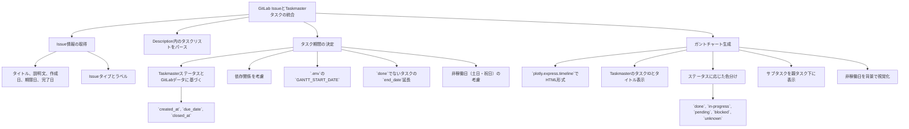

# ガントチャート生成機能

## 1. ツールの概要

### 目的

`taskmaster`で管理されているタスク情報とGitLabのIssue情報を統合し、プロジェクトの進捗状況を視覚的に把握するためのガントチャートを自動生成する。プロジェクトマネジメントを効率化し、関係者間での情報共有を促進する。

### スコープ

GitLabのIssueおよび`taskmaster`のタスク情報をデータソースとし、`plotly`ライブラリを用いてインタラクティブなHTML形式のガントチャートを生成する。タスクの期間を考慮し、Issueタイプやステータスに応じてガントチャート上のバーを色分けすることで、視覚的に情報を把握しやすくする。依存関係を表示し、非稼働日を考慮する。生成されたガントチャートはファイルとして出力される。

### 機能

GitLabのIssue情報（タイトル、説明文、作成日、期限日、完了日、Issueタイプ、ラベル）とTaskmasterのタスク情報（ID、タイトル、ステータス、依存関係）を取得する。IssueのDescription内のタスクリストもパースする。タスクの開始日と終了日を決定し、遅延タスクの自動延長や、土日および日本の祝日を考慮した営業日を計算する。`plotly.express.timeline`を使用してガントチャートを生成し、インタラクティブなHTMLファイルとして出力する。タスク表示、ステータスに応じた色分け、サブタスク表示、非稼働日の視覚化を行う。

### 入力

- 設定ファイル: `.env`
  - GitLabのベースURL (`GITLAB_BASE_URL`)
  - 個人アクセストークン (`GITLAB_PERSONAL_ACCESS_TOKEN`)
  - プロジェクトID (`GITLAB_PROJECT_ID`)
  - SSL証明書の検証設定 (`GITLAB_SSL_VERIFY`)
  - オプションのガントチャート全体開始日 (`GANTT_START_DATE`)
  - オプションの国コード (`HOLIDAY_COUNTRY`)
- タスク情報: `.taskmaster/tasks/tasks.json` (Taskmasterのタスク情報)

### 出力

- インタラクティブなHTML形式のガントチャートファイル（デフォルト: `gantt_chart.html`）
- 指定された場合はPNG, JPEG, WEBP, SVG, PDF形式の画像ファイル。
- 標準出力: スクリプトの実行状況を示すログメッセージ。ログレベルはコマンドライン引数`--log-level`で制御可能である。

## 2. 外面仕様書

### 2.1. 機能要件

GitLabの特定プロジェクトのIssue一覧と`taskmaster`のタスク情報を統合し、ガントチャートを生成する。以下の機能要件を満たすように設計されている。



上記のフローチャートは、機能要件の全体像を視覚的に示している。GitLab IssueとTaskmasterタスクの統合から始まり、Issue情報の取得、タスクリストのパース、タスク期間の決定を経て、ガントチャートの生成に至るプロセスを表している。各ステップで考慮される要素や条件も明示している。

### 2.2. 非機能要件

- Python 3.xが動作する環境で実行可能である。
- `python-gitlab`, `python-dotenv`, `pandas`, `plotly`, `holidays`ライブラリがインストールされている。
- GitLab APIの接続情報とオプションの`GANTT_START_DATE`は`.env`ファイルで管理される。
- 生成されたガントチャートはインタラクティブなHTMLファイルとして出力される。
- `--dry-run`オプションにより、ファイル出力なしでシミュレーション実行が可能である。
- `--log-level`オプションでログの詳細度を制御する。
- `--output`オプションで出力ファイルパスを指定する。
- `--format`オプションでHTML以外の画像形式（PNG, JPEG, WEBP, SVG, PDF）での出力が可能である。`kaleido`ライブラリが必要である。

### 2.3. システム構成 (高レベル)

- 言語: Python 3
- 主要ライブラリ: `python-gitlab`, `python-dotenv`, `pandas`, `plotly`, `holidays`
- アーキテクチャ: コマンドラインツールとして動作し、TaskmasterのJSONファイルとGitLab APIからデータを取得・加工し、Plotlyを用いてガントチャートを生成する。

## 3. 内部仕様書

### 3.1. 機能要件 (実装詳細)

#### データ取得

- `load_taskmaster_tasks(tag="master")`: `.taskmaster/tasks/tasks.json`からタスクを読み込み、`full_id`をキーとするフラットな辞書構造に変換。サブタスクも再帰的に処理。
- `get_gitlab_issues(gl, project_id)`: `python-gitlab`ライブラリを使用して、指定されたGitLabプロジェクトの全Issueを取得。
- `map_tasks_and_issues(gitlab_issues)`: GitLab IssueのタイトルからTaskmasterのタスクIDを抽出し、`{Taskmaster_ID: GitLab_Issue_Object}`のマッピングを作成。
- `parse_task_list(description)`: IssueのDescriptionからMarkdown形式のタスクリスト（`- [ ] Task`）を正規表現(`re.compile(r"^[ \t]*- \[([ |x])\] (.*)$", re.MULTILINE)`)でパースし、完了状態とタイトルを抽出。
- スケジュール計算ロジック (`prepare_gantt_data`関数内):
  - **ASAP (As Soon As Possible) スケジューリング**に基づいてタスクの開始日と終了日を決定する。
  - 終了日 (`end_date`) の決定:
    - Taskmasterのステータスが`done`かつGitLab Issueに`closed_at`があればそれを優先。
    - なければ`due_date`。
    - どちらもなければ`today + 7 days`をフォールバックとする。
    - `done`ではないタスクで、`end_date`が過去の場合でも、`end_date`を自動的に延長するロジックは削除された。

#### 開始日 (`start_date`) の決定

- 優先順位:
      1. 完了済みタスク (`status: done`):
         - GitLab Issueの`created_at`を開始日とし、`closed_at`を終了日とする。
         - `created_at`がない場合は、`closed_at`から1日を逆算した日を開始日とする。
         - これらの日付は他のロジックの影響を受けず固定される。
      2. 依存関係のあるタスク:
         - 全ての先行タスクの終了日の中で最も遅い日付の翌営業日を開始日とする。
      3. 独立したタスク (依存関係なし):
         - そのタスク自身のGitLab Issueの`created_at`を開始日とする。
         - ただし、`.env`の`GANTT_START_DATE`が設定されており、そのタスクの`created_at`よりも後の日付である場合は、`GANTT_START_DATE`を開始日とする。`created_at`と`GANTT_START_DATE`の遅い方を採用する。
      4. フォールバック:
         - 上記のいずれでも開始日が決定できない場合、全GitLab Issueの`created_at`の中で最も古い日付（`earliest_created_at`）を開始日とする。
         - `earliest_created_at`も決定できない場合は、`today`を開始日とする。
  - 期間の調整:
    - `end_date < start_date`の場合、`end_date`を`start_date + 1 day`に調整。
    - `end_date == start_date`の場合も同様に`end_date`を`start_date + 1 day`に調整し、最低1日の期間を確保。
  - 営業日計算:
    - `is_working_day(d, country_holidays)`関数で土日および`holidays`ライブラリから取得した祝日をチェックする。
    - `get_next_working_day(d, country_holidays)`関数を用いて次の営業日を計算する。

#### ガントチャート生成 (`generate_gantt_chart`関数内)

- `plotly.express.timeline`を使用してガントチャートの基本を生成。
- `fig.update_yaxes(autorange="reversed")`でY軸の表示順を反転。
- 非稼働日 (`is_working_day`がFalseの日) は`plotly.graph_objects.layout.Shape`で半透明の矩形を描画し、背景に表示する。
- タスクバーの色分けは、`color_discrete_map`を使用してステータスに応じた色を設定する。
- サブタスクは親タスクと同じ期間で、異なる色（グレー）で表示する。
- 依存関係の矢印は、PlotlyのY軸のタスク順序を動的に取得する。
- その後、`go.layout.Annotation`を使用して描画する。
- `x_start_arrow`, `x_end_arrow`, `y_start_arrow`, `y_end_arrow`を計算し、矢印の始点と終点を決定する。

### 3.2. 非機能要件 (実装詳細)

- 設定管理: `dotenv.dotenv_values()`を使用して`.env`ファイルから設定を読み込む。
- ロギング: `logging`モジュールを使用し、`argparse`で指定された`--log-level`に基づいてログレベルを設定。`basicConfig`でフォーマットと出力先（`sys.stdout`）を設定。
- エラーハンドリング: GitLab API呼び出しやファイル操作において`try-except`ブロックを使用する。
- `gitlab.exceptions.GitlabError`や`FileNotFoundError`、`json.JSONDecodeError`などを捕捉する。
- エラーの発生などに対して、適切なログメッセージを出力し、`sys.exit(1)`で終了する。
- 出力形式の選択: `fig.write_html()`または`fig.write_image()`を使用し、`--format`引数に応じてHTMLまたは画像ファイルとして出力。画像出力には`kaleido`ライブラリが必要。

### 3.3. システム構成 (詳細: 処理フロー、データモデル、主要モジュール)

#### 処理フロー

`main()`関数が以下の順序で処理を進行する。

  1. コマンドライン引数のパース (`argparse`) とロギング設定。
  2. `.env`ファイルからGitLab接続情報と`GANTT_START_DATE`を読み込む。
  3. `python-gitlab`クライアントの初期化と認証を実施する。
  4. `load_taskmaster_tasks()`でTaskmasterタスクを読み込む。
  5. `get_gitlab_issues()`でGitLab Issueを読み込む。
  6. `map_tasks_and_issues()`でTaskmasterタスクとGitLab Issueのマッピングを作成する。
  7. `prepare_gantt_data()`でガントチャート表示用のPandas DataFrameを準備する。
  8. `generate_gantt_chart()`でガントチャートを生成し、指定されたパスと形式で出力する。

#### データモデル

- Taskmasterタスク: `load_taskmaster_tasks`により、`id`, `title`, `description`, `status`, `dependencies`, `subtasks`などのフィールドを持つフラットな辞書としてメモリに保持される。
- GitLab Issue: `get_gitlab_issues`により、`python-gitlab`のIssueオブジェクトとして取得される。`iid`, `title`, `description`, `created_at`, `due_date`, `closed_at`, `labels`, `issue_type`などの属性を持つ。
- `task_id_to_issue`: `{Taskmaster_ID: GitLab_Issue_Object}`形式の辞書で、TaskmasterタスクとGitLab Issueの紐付けに使用する。
- ガントチャートDataFrame: `prepare_gantt_data`により生成されるPandas DataFrame。`Task` (タスク名), `Start` (開始日), `Finish` (終了日), `Status` (ステータス), `Color` (表示色), `TaskID` (元のTaskmaster ID) などのカラムを持つ。
- 主要モジュール:
  - `load_taskmaster_tasks()`: Taskmasterタスクの読み込みとフラット化。
  - `get_gitlab_issues()`: GitLab Issueの取得。
  - `map_tasks_and_issues()`: Taskmaster IDとGitLab Issueのマッピング。
  - `is_working_day()`: 営業日判定（土日・祝日考慮）。
  - `get_next_working_day()`: 次の営業日計算。
  - `parse_task_list()`: Issue DescriptionからのMarkdownタスクリストのパース。
  - `prepare_gantt_data()`: ガントチャート用データフレームの準備、日付計算ロジックのコア。
  - `generate_gantt_chart()`: Plotlyを使用したガントチャートの生成とファイル出力。

## 4. ユーザーマニュアル

### 4.1. 概要

このマニュアルは、`tmgantt/main.py`スクリプトを使用し、TaskmasterのタスクとGitLab Issueからガントチャートを生成する手順を説明する。

### 4.2. インストールとセットアップ

前提条件: Python 3.x以上をインストールする。

ライブラリのインストール: `pyproject.toml`に記載されている依存ライブラリをインストールする。プロジェクトのルートディレクトリ (`taskmaster-gitlab-gantt/`) で、以下のコマンドを実行する。

```bash
uv venv # 仮想環境がまだない場合
uv pip install .
```

画像出力する場合は`kaleido`もインストールしてください。

```bash
uv pip install "kaleido"
```

設定ファイルの作成: プロジェクトのルートディレクトリに`.env`ファイルを作成し、GitLabへの接続情報とオプションのガントチャート全体開始日を記述する。

```env
GITLAB_BASE_URL="https://gitlab.com"
GITLAB_PERSONAL_ACCESS_TOKEN="your_personal_access_token"
GITLAB_SSL_VERIFY="true"
GITLAB_PROJECT_ID="12345"
GANTT_START_DATE="2023-01-01" # オプション: ガントチャートの全体開始日
HOLIDAY_COUNTRY="JP" # オプション: 祝日計算の国コード (例: US, GB, FR). デフォルトは JP (日本)
```

`.env`ファイルは`.gitignore`に追加し、リポジトリへコミットしない。

### 4.3. 実行方法

通常実行

 ```bash
 # スクリプトを実行する (デフォルトで gantt_chart.html が生成される)
 uv run tmgantt
 ```

出力ファイルパスの指定

```bash
uv run tmgantt --output my_gantt.html
```

出力形式の指定 (画像出力には`kaleido`が必要である)

```bash
uv run tmgantt --format png --output my_gantt.png
```

Dry Run

実際にファイル出力せず、シミュレーションしログを確認する。

```bash
uv run tmgantt --dry-run
```

ログレベルの変更

```bash
uv run tmgantt --log-level DEBUG
```

### 4.4. トラブルシューティング

- 認証エラー: `.env`ファイルのGitLab設定を確認し、正しいか確認する。
- プロジェクトが見つからない: `GITLAB_PROJECT_ID`を確認し、正確であるか確認する。
- SSLエラー: `GITLAB_SSL_VERIFY`設定を見直し、問題がないか確認する。
- ガントチャートが生成されない: Taskmasterの`tasks.json`が存在するか、または正しい形式か確認する。GitLab Issueが取得できているかログで確認する。
- 画像出力ができない: `kaleido`ライブラリのインストールを確認する。

## 5. 開発者向け情報

### 5.1. デバッグ方法

- プロジェクトのインストール: プロジェクトのルートディレクトリ (`taskmaster-gitlab-gantt/`) で`uv venv`、`uv pip install .`を実行。
- コマンドラインからの実行: `pyproject.toml`で定義したエントリポイント (`tmgantt`) を使用。
  - Dry Runモード: `tmgantt --dry-run --log-level DEBUG`
  - 詳細ログ: `tmgantt --log-level DEBUG`
  - 出力形式の指定: `tmgantt --format png --output my_gantt_chart.png`
- Pythonデバッガーの使用 (VS Codeなど): `.vscode/launch.json`を設定し、`main.py`をデバッグ実行。

### 5.2. 公開方法

- `pyproject.toml`の更新: `authors`, `description`, `version`を適切に更新する。
- ビルドツールのインストール: `uv pip install build twine`を実行する。
- パッケージのビルド: プロジェクトのルートディレクトリで`python -m build`を実行し、`dist/`に配布パッケージを生成する。
- PyPIへのアップロード: `twine`を使用して`python -m twine upload dist/*`でPyPIにアップロードする。

## 6. 今後の課題・拡張性

### 依存関係の視覚化の強化

`plotly.express.timeline`では依存関係の矢印を直接描画する機能がない。
そこで、`plotly.graph_objects`を用いたカスタム描画の精度向上を検討する。
複雑な依存関係（例: 複数の依存元、依存関係の種類による区別）の視覚的表現方法も検討する。

### サブタスクの表示の改善

サブタスクがガントチャート上で正しく表示されない、または視覚的に分かりにくい場合がある。Plotlyでのサブタスクの描画方法を改善し、親タスクとの関連性をより明確にする。

### マイルストーンの表示

GitLabのマイルストーン機能や特定のラベルを、ガントチャート上で視覚的に区別できるマイルストーンとして表示する機能の検討。

- 国際化（i18n）の考慮: 祝日計算ロジックを`holidays`ライブラリへ移行済み。今後、より精度の高い祝日情報が必要な国（例：中国の振替休日）については、各国のコントリビューターによる改善や、専用APIの利用を検討する。
- パフォーマンス最適化: 大量のタスクや依存関係がある場合の、データ処理およびチャート生成のパフォーマンス改善。
- CLIオプションの追加: ガントチャートの期間指定、特定のタスクのフィルタリング、出力形式の選択など、より柔軟なCLIオプションの提供。

## 7. 解決済み課題

- `start_date`の精度向上:
  - GitLab APIから`start_date`が直接取得できない制約に対し、ASAP (As Soon As Possible) スケジューリングロジックを導入し、精度を向上させた。
  - 完了済みタスクの`created_at`と`closed_at`を尊重し、期間を固定する。
  - 依存関係のあるタスクは先行タスクの終了日を考慮する。
  - 独立したタスクは自身の`created_at`を優先し、`GANTT_START_DATE`との比較で遅い方を採用する。
